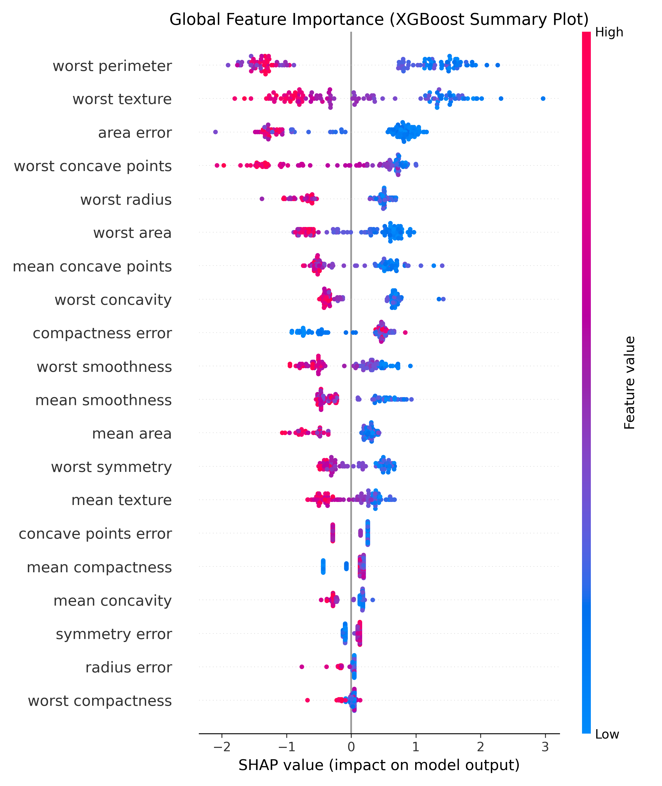
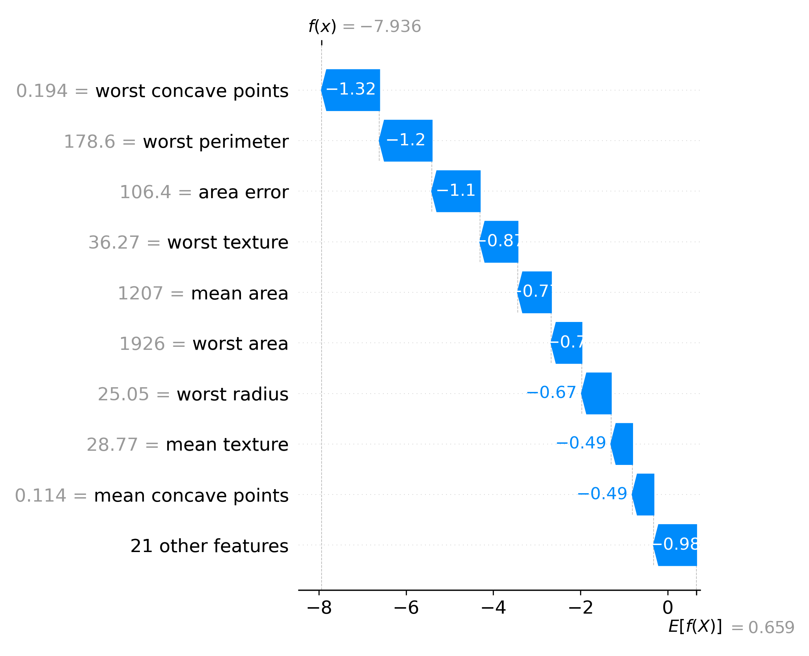

# 🩺 Multi-Model Clinical Diagnostic Benchmark & XAI Portal

[](https://hacersulun-xai-breast-cancer-diagnostic-app-nu0syb.streamlit.app/)

A production-ready machine learning, benchmarking, and explainability pipeline that evaluates diverse model architectures (Tree-based vs. Linear) on the **Breast Cancer Wisconsin** dataset and leverages **SHAP (SHapley Additive exPlanations)** to deliver transparent, interpretable clinical insights.

---

## 🚀 Key Features

- **Layered Production Architecture:** Built using an industry-standard modular pattern separating data ingestion, multi-model lifecycle management, and explainability layers (`src/`).
- **Multi-Model Benchmarking:** Evaluates and compares three distinct classifiers — **Random Forest**, **XGBoost**, and **Logistic Regression** — based on Precision, Recall, Accuracy, and F1-Score.
- **Dynamic Explainable AI (XAI):** Resolves the "black-box" dilemma of machine learning by dynamically routing traffic through appropriate SHAP explainers (`TreeExplainer` vs. `LinearExplainer`), providing patient-specific local waterfall attributions.
- **Interactive UI Dashboard:** Implemented an end-user interface via **Streamlit** allowing clinicians to seamlessly simulate patient features and observe shifting feature weights across different model backends.

---

## 📁 Repository Structure

```text
├── src/
│   ├── __init__.py
│   ├── data_loader.py   # Data ingestion, processing & stratification
│   ├── model.py         # Multi-model training lifecycle & benchmarking
│   └── explainer.py     # Dynamic SHAP explainer assignment & routing
├── app.py               # Streamlit Multi-Page UI Layer
└── requirements.txt     # Dependency management & profiling
```

---

## 📊 Evaluation Metrics (Benchmark)

Real-time evaluation metrics extracted during the pipeline run on the test dataset:

| Model               | Accuracy | Precision | Recall | F1-Score |
|---------------------|----------|-----------|--------|----------|
| Logistic Regression | 0.9649   | 0.9594    | 0.9861 | 0.9726   |
| XGBoost             | 0.9561   | 0.9466    | 0.9861 | 0.9660   |
| Random Forest       | 0.9561   | 0.9589    | 0.9722 | 0.9655   |

---

## 🖼️ Explainable AI (XAI) Visualizations

The following plots were generated during the system benchmark to interpret model behavior:

### 1. Global Feature Importance (XGBoost Model)

This plot highlights which clinical features contribute most to the model's global decision-making process across the entire dataset.



### 2. Patient-Specific Local Explanation (Waterfall Plot)

This chart provides a single-patient clinical workflow, showing how individual feature measurements shift the diagnostic prediction away from or toward a malignant classification.



---

## 🛠️ Tech Stack

| Category                  | Libraries / Frameworks                        |
|---------------------------|-----------------------------------------------|
| Languages & Frameworks    | Python, Streamlit                             |
| Machine Learning Core     | Scikit-Learn, XGBoost                         |
| Explainable AI (XAI)      | SHAP (Tree & Linear Explainers)               |
| Data & Analytics          | Pandas, NumPy, Matplotlib                     |
